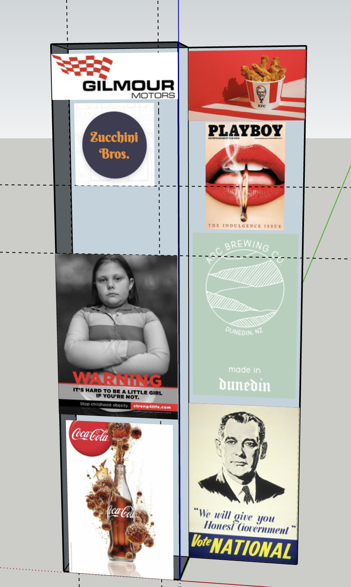
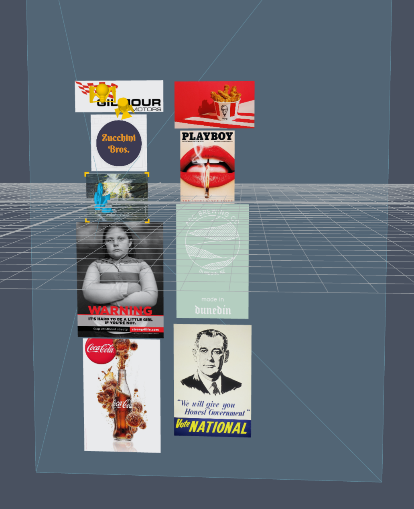

- [[Demo Version 2 - Marker-Based]]
	- V2.3
		- Marker: Holger's Painting
		- Location: On RHS walls
		-
	- Started working on the marker-based extension of the lens two days ago.
	- Measured the wall and how much real-estate I exactly have for the virtual content and created a 3D model to scale in Sketch Up and used it place the advertisements on.
	- Creating the model to scale saves time in terms of the number of time adjustments need to be made to the lens.  Because once you have the model it's simply a matter of importing it to Lens Studio and placing it relative to the marker.
	- {:height 583, :width 350}
	  SketchUp model
	-
	- {:height 445, :width 344}
	  Lens Studio scene
	-
	- **Issues** With the marker being relatively smaller than the Atea Project poster the number of posters it can anchor are smaller. The marker goes off of view sooner and rendering the. bottom
-
-
-