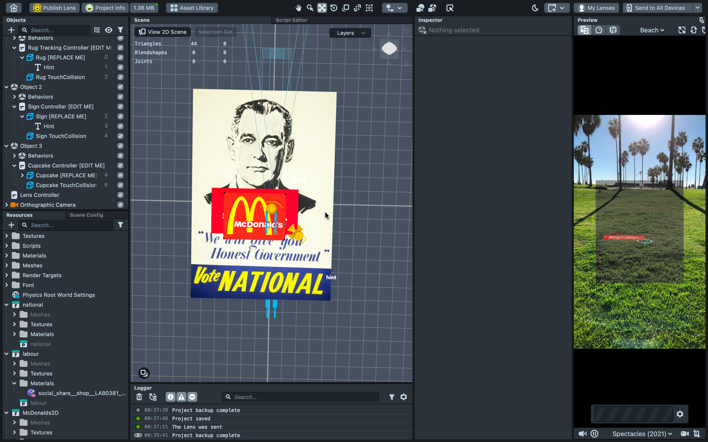

- [[Demo Version 3 - Single Plane Tracking Template Based]]
	- **Version 0.2**
	- Requires extensive API knowledge to understand the code.
	- **Progress**
		- I've so far managed to have a single poster be attached on click to vertical planes.
			- Possibly, could create a vertical wall with multiple posters on SketchUp and use that as the object.
			- But, the most pressing issue is on how to get the objects to be automatically placed on walls when the orientation matches the defined orientation of the object.
			- {:height 275, :width 420}
			- 
			-
			- This is a demonstration from using the template as-is.
			- to
- [[Lens Studio 101]]
	- The issue of Lens Studio crashing when the deployed lens starts running on the spectacles, though persistent on the work computer which runs on Windows (even on the new machine with the better hardware), is not an issue with my PC running on MacOS.
- [[Minaee, Lian & Yan 2022]]
-