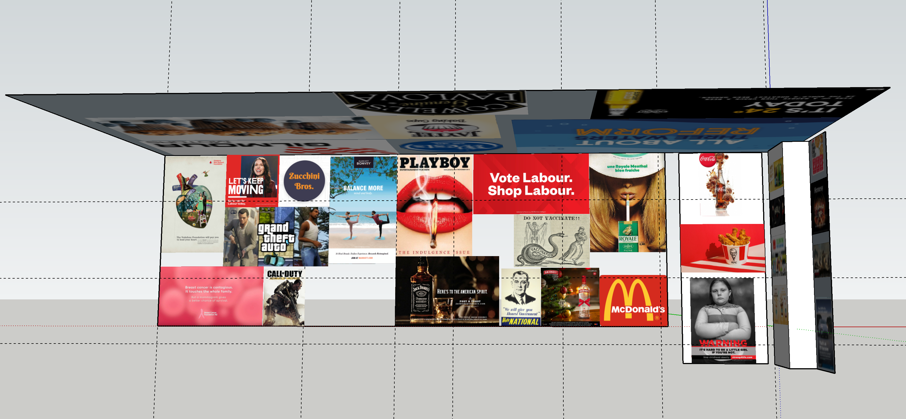

- [[Demo Version 2 - Marker-Based]]
- **V2.2.5.3**
-
- This version uses extended marker tracking. Since the first time I used extended marker tracking it now has been modified to support spectacles.
- Works a lot better now. Not jittery.
-  The sketchup model Im using for the lens is made to scale (RHSWall+Door+Ceiling)