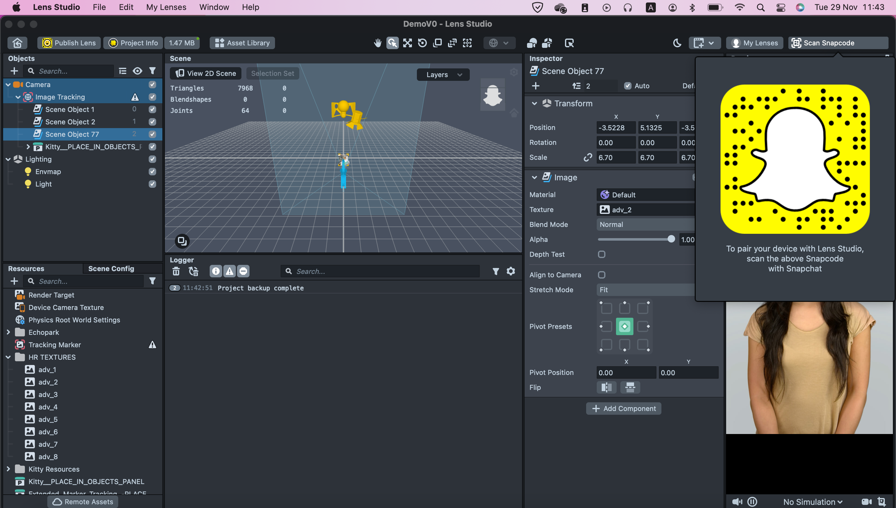
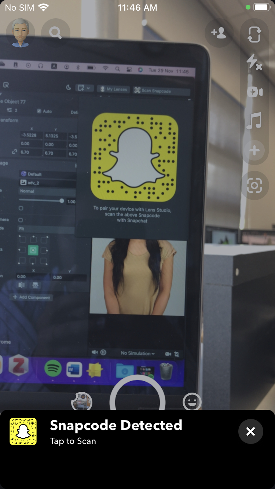
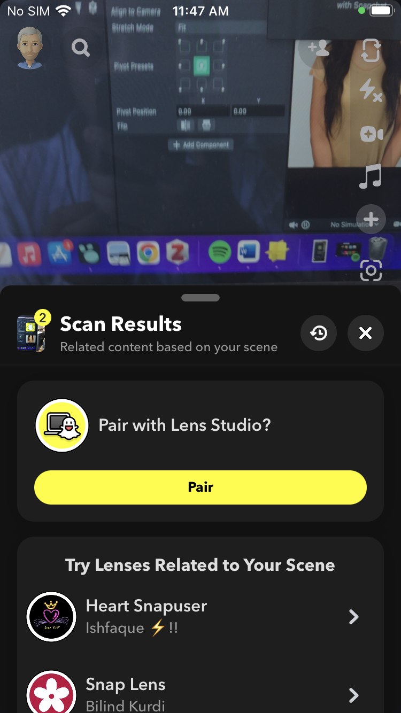
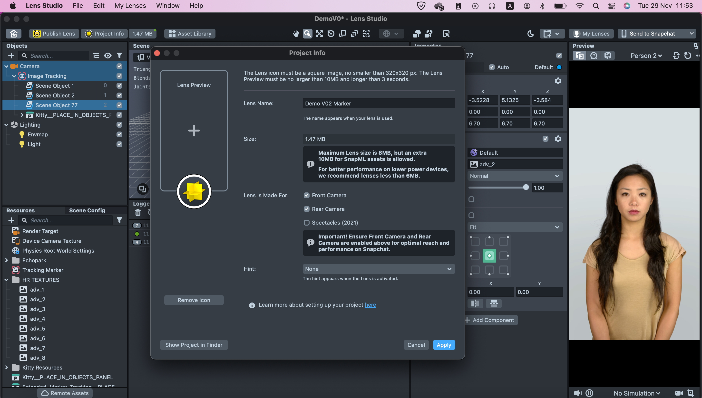
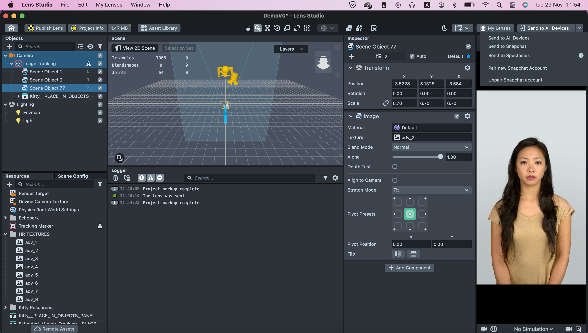

- Prerequisites:
	- Snapchat account
	- Mobile device with an OS over 12.08.0 +
	- Spectacles (2021)
	- Pair the spectacles with the mobile snapchat account
- To get started with lens Studio, firstly install Lens Studio [Link to download](https://ar.snap.com/download)
- Open Lens Studio and you should see this page:
  
- Click Login to my lenses, to connect your snapchat account with lens studio.
	- When you click on the button, you will be redirected to the browser to log into your snapchat account.
	- Log in to your snapchat account with your credentials.
	- Then, grant permission for your account to be connected with Lens Studio and your Lens Studio should look something like this,
	  
- File > New Project and you can design your new scene (aka lens)
- Once you're done creating your scene there are several options to preview it:
	- Webcam
	- Preview via your snapchat account on your mobile device or spectacles 2021
- To preview via your snapchat, you have to pair your device with Lens Studio
	- Click on 'Preview on Snapchat' on the top-right corner
	  
	- Now scan the snapcode with snapchat on your mobile phone,
	  {:height 223, :width 122}
	- Then, click on 'Pair'
	  {:height 194, :width 103}
	- If the pairing was successful, then the button on top-right corner of Lens Studio should've changed to 'Send to Snapchat'
- Given that you've created a lens that will be supported on Spectacles (2021), you need to enable Spectacles (2021) as a supported device for the lens in 'Project Info'
  
- Once you've checked 'Spectacles (2021)' click on 'Apply'
- Now, the preview button should have changed to ' Send to All Devices' with a dropdown
  
- To be able to deploy a lens to spectacles
	- All 3 devices (PC, phone, spectacles) need to be on the same network
-
-
-