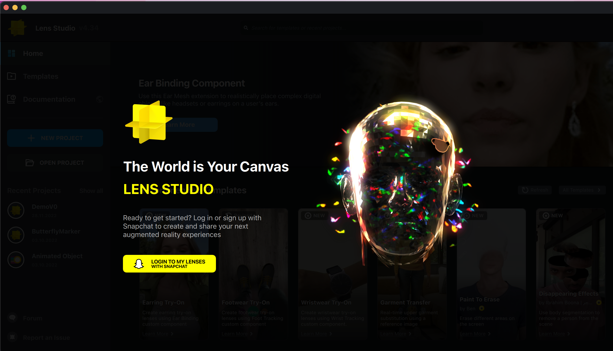
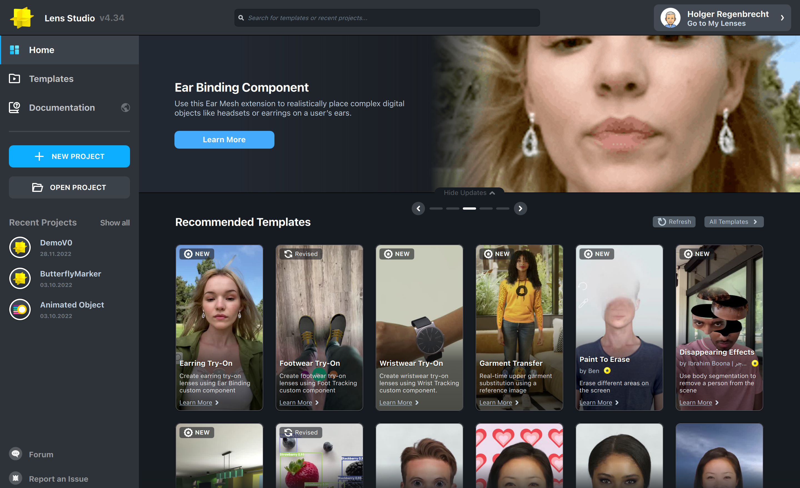

- Prerequisites:
	- Snapchat account
	- Mobile device with an OS over 12.08.0 +
	- Spectacles (2021)
	- Pair the spectacles with the mobile snapchat account
- To get started with lens Studio, firstly install Lens Studio [Link to download](https://ar.snap.com/download)
- Open Lens Studio and you should see this page:
  
- Click Login to my lenses, to connect your snapchat account with lens studio.
	- When you click on the button, you will be redirected to the browser to log into your snapchat account.
	- Log in to your snapchat account with your credentials.
	- Then, grant permission for your account to be connected with Lens Studio and your Lens Studio should look something like this,
	  
- File > New Project and you can design your new scene (aka lens)
- Once you're done creating your scene there are several options to preview it:
	- Webcam
	- Preview via your snapchat account on your mobile device or spectacles 2021
- To preview via your snapchat, you have to pair your device with