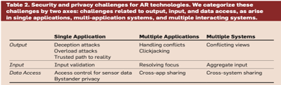

- Security and Privacy for Augmented Reality Systems
  authors:: [[Franziska Roesner]] [[Tadayoshi Kohno]] [[David Molnar]]
  type:: [[Legal]] 
  category:: [[Literature]]  
  published-year:: 2014
  DOI:: [10.1145/2580723.2580730](https://doi.org/10.1145/2580723.2580730) 
  citation:: Franziska Roesner, Tadayoshi Kohno, and David Molnar. 2014. Security and privacy for augmented reality systems. Commun. ACM 57, 4 (April 2014), 88–96. https://doi.org/10.1145/2580723.2580730
- What new security and privacy research challenges arise with AR systems and the technologies that support them? What novel oppor- tunities do AR technologies create for improving security and privacy?
	- Micro- soft’s SDK for Kinect,20 which provides accurate motion sensing by combining an RGB camera, a depth camera, and a multi-array microphone, has enabled numerous prototype AR applications
- these technologies should leverage standard security best practices, such as on-device and network encryption.
- ... obstactles handling conflicts between multiple applications sharing an AR system’s output—that are simultaneously intellectually challenging yet surmountable. Other challenges, such as access control for data, ...
- Malicious applications can use similar techniques to cause sensory overload for users - "output attacks"
	- By flashing bright lights in the display, playing loud sounds, or delivering intense haptic feedback, applications could physically harm users.
	- As a last resort for output attacks, users must be able to easily and reliably return to the real world, that is, with all output devices verifiablly turned off
- Another approach may be to reserve a trusted region of the display that always shows the real world.
- "input attacks" Traditional input validation techniques are likely to apply, but the designers of AR systems should be aware of their neces- sity in this new context
- "data access challenges" an im- portant challenge for AR systems will be to balance the access required for functionality with the risk of an appli- cation stealing data or misusing that access.
	- a malicious appli- cation may leak the user’s location or video feed to its backend servers.
- AR system designers must consider the appropriate granu- larity for these permissions, and the design of usable permission manage- ment interfaces will be important.
	- Perhaps an application only requires access to a portion of the screen when the user is in a certain location, or only needs to know about certain objects the sys- tem recognizes
- "By- standers should be able to opt out of or be anonymized (for example, blurred) in the recordings of others;
  AR users may need methods to prove to skepti- cal bystanders that such safeguards are in place."
- Conflicts among multiple applications attempting to use these output devices can lead to security concerns (output sharing)
	- For example, a malicious application might try to obscure content presented by another application
	  future AR systems must handle conflicts between multiple appli- cations attempting to produce output.
- designers must create interfaces that make the origins of displayed content clear to or easily discoverable by users.
	- it may be important for users to know which content was generated by which application— for instance, whether an annotated product recommendation comes from a friend or an advertiser.
- Improperly designed focus resolution may make it easy for malicious applications to steal user input intended for another application
	- When multiple applications are active and might re- ceive voice or other input at any given time, there must be either a usable way for users to bring applications into fo- cus, or for the system to determine the correct intended destination for input commands when focus is ambiguous.
- Researchers must explore appropri- ate access control models for cross- application sharing.
	- users may wish to share virtual objects between applications.
- AR systems will need to evolve new user gestures to in- dicate sharing intent.
- " Such conflicting views will require users to manage mental models of who can perceive which information, lest they accidentally reveal private information intended only for themselves.
  Addressing this concern will require innovations in interface design for aid- ing users in this task.
	- When there are multiple users all using dfferent AR systems.
-
	- "AR applications will require long-term or permanent access to sensor data at a scale beyond smartphone applications.
	- [7]"
	  "How AR technologies contribute to improved security:
	- A personal heads-up display combined with a haptic sensor for discreet input would allow for greatly improved privacy
	  AR systems can also act as an en- hanced password manager for users, presenting passwords or password hints via the personal display.
	- Future systems can leverage AR technologies to detect privacy or security conditions of which the user should be alerted.
	  Such systems could also detect physi- cal deception attempts.
	  Similarly, exist- ing work on computerized interpreta- tion of facial expressions12 could be ap- plied to behavior-based lie detection."
- 