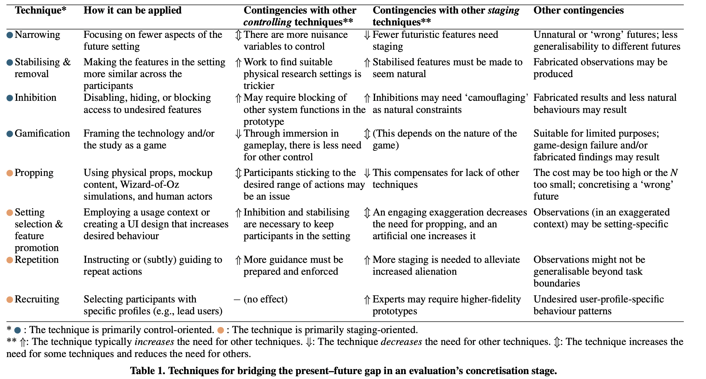

- Evaluation of Prototypes and the Problem of Possible Futures
- authors:: [[Antti Salovaara]], [[Antti Oulasvirta]], [[Giulio Jacucci]]
  type:: [[study design]]
  published-year:: 2017
  DOI:: [10.1145/3025453.3025658]( http://dx.doi.org/10.1145/3025453.3025658) 
  citation:: Antti Salovaara, Antti Oulasvirta, and Giulio Jacucci. 2017. Evaluation of Prototypes and the Problem of Possible Futures. In Proceedings of the 2017 CHI Conference on Human Factors in Computing Systems (CHI '17). Association for Computing Machinery, New York, NY, USA, 2064–2077. https://doi.org/10.1145/3025453.3025658
	- [[card]] The study explores the suitability of experiment methodologies used in HCI in terms of addressing the present-future gap.
		- The present-future gap arises when  prototypes are tested to identify how these technologies would fit in the future. Because, there are many factors that would affect the interaction with these technologies in the future that are not adjusted for in the present studies. Such factors in retrospect may invalidate the findings of a study.
		- The authors look in to different levels of staging or controlling such factors in present day experiments to ensure that  an experiment remains valid in the future. To have a favourable projection validity (i.e. if the conclusions remain valid in the future).|
		  
		  Furthermore, the authors suggest that researchers should embed adjusting for future from the envisioning stage onwards and
			-